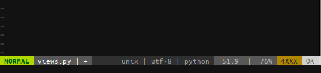

# vim-no-fixme

This plugin provides amount of FIXME|TODO|XXX comments in current file for the [lightline](https://github.com/itchyny/lightline.vim) vim plugin.





## Installation

Install using a plugin manager by adding `fisle/vim-no-fixme`


## Integration

1. Register the component:

   ```
   let g:lightline.component_expand = {
     \ 'nofixme': 'nofixme#amount',
   \}
   ```

2. Set color:

   ```
   let g:lightline.component_type = {
     \ 'nofixme': 'warning',
   \}
   ```

3. Add component to lightline:

   ```
   let g:lightline.active = {
     'right': [['nofixme']]
   \}
   ```

   ​

## License

Released under the [MIT License](https://github.com/fisle/vim-no-fixme/blob/master/LICENSE.md)
